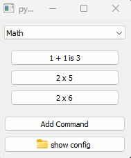

# py-commander
very hacky tool to launch py commands from configs

Load YAML into buttons. Can be reused for any command 
```yaml
- name: 1 + 1
  category: Math
  command: "print(1+1)"

- name: 2 x 5
  category: Math
  command: "print(2*5)"
```


### Sample use case
- load blender file
- import a FBX
- export from substance to a folder

### requires
Python modules:
- Pyside2
- PyYaml